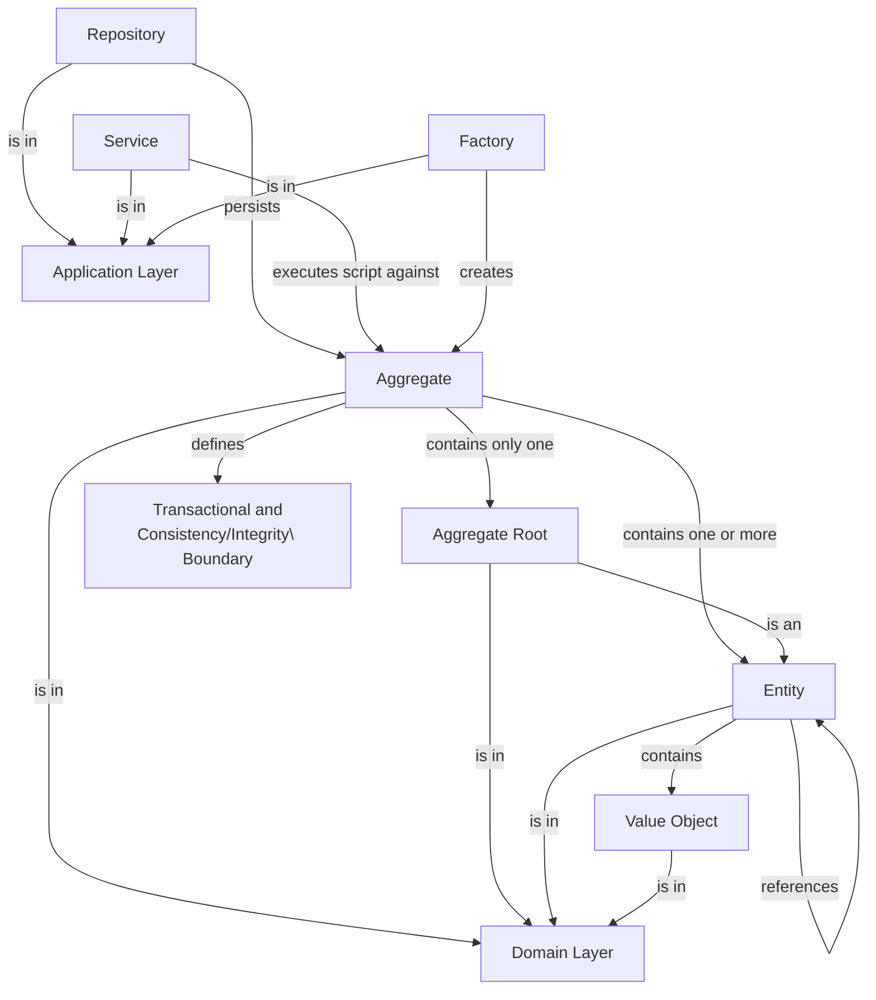

## DDD Tactical Patterns

A first draft of a Concept Map for DDD Tactical Patterns

```mermaid
flowchart TD
    app[Application Layer]
    domain[Domain Layer]
    agg[Aggregate]
    entity[Entity]
    repo[Repository]
    vo["Value Object"]
    aggroot["Aggregate Root"]
    service[Service]
    factory[Factory]
    txnBoundary["Transactional and\nConsistency/Integrity\ Boundary"]

    agg -->|is in| domain
    agg -->|defines| txnBoundary
    agg -->|contains only one| aggroot
    agg -->|contains one or more| entity
    
    aggroot -->|is an| entity
    aggroot -->|is in| domain
    
    entity -->|contains| vo
    entity -->|references| entity
    entity -->|is in| domain
    
    vo -->|is in| domain

    repo -->|is in| app
    repo ---->|persists| agg
    
    service -->|executes script against| agg
    service -->|is in| app

    factory --->|creates| agg
    factory -->|is in| app
```
