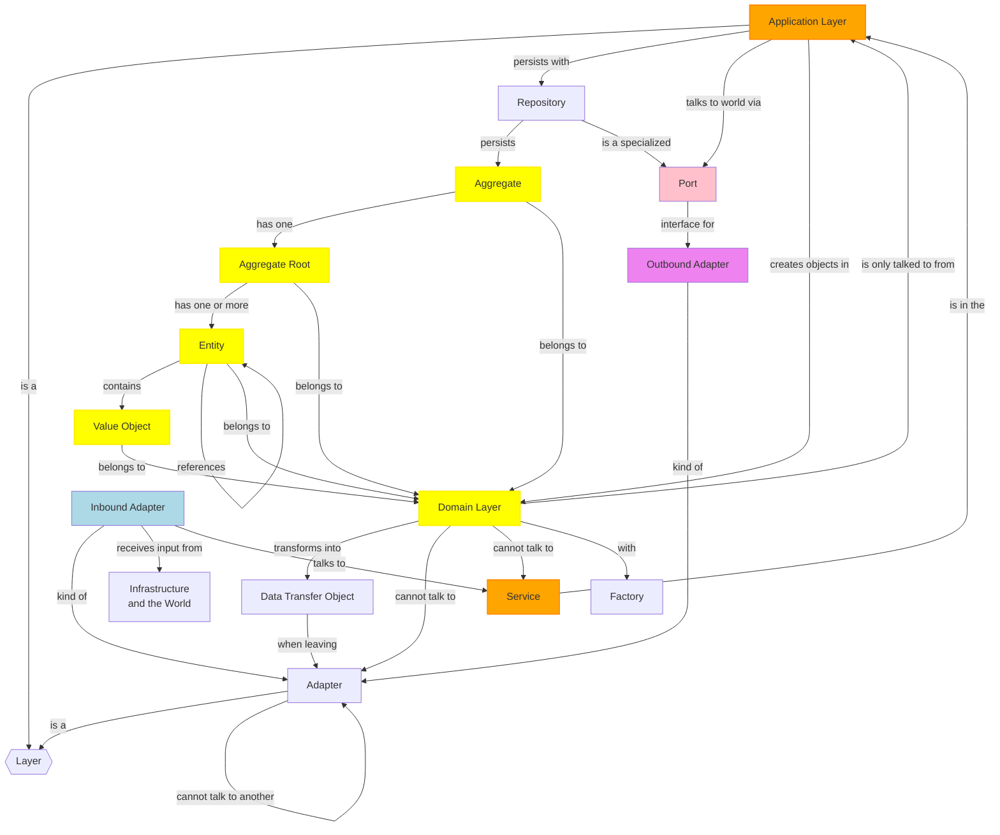

```mermaid
flowchart TD
    app[Application Layer]
    domain[Domain Layer]
    adapter[Adapter]
    inbound[Inbound Adapter]
    outbound[Outbound Adapter]
    port[Port]
    entity[Entity]
    repo[Repository]
    vo["Value Object"]
    dto[Data Transfer Object]
    aggroot["Aggregate Root"]
    agg[Aggregate]
    service[Service]
    factory[Factory]
    layer{{Layer}}
    world[Infrastructure\nand the World]
    classDef applayer fill:orange,stroke:darkorange,stroke-width:2px;
    class app,service applayer;
    classDef domlayer fill:yellow,stroke:#FFEF00,stroke-width:2px
    class domain,entity,vo,agg,aggroot domlayer
    style port fill:pink
    style inbound fill:lightblue
    style outbound fill:violet

    inbound -->|kind of| adapter
    outbound --->|kind of| adapter
    
    adapter -->|is a| layer
    adapter -->|cannot talk to another| adapter
    app -->|is a| layer
    service -->|is in the| app

    inbound -->|receives input from| world
    inbound -->|talks to| service

    repo -->|persists| agg
    repo -->|is a specialized| port

    agg -->|has one| aggroot
    domain -->|transforms into| dto -->|when leaving| adapter
    aggroot -->|has one or more| entity
    entity -->|contains| vo
    entity -->|references| entity

    domain -->|is only talked to from| app
    domain -->|cannot talk to| adapter
    domain -->|cannot talk to| service

    vo -->|belongs to| domain
    entity -->|belongs to| domain
    agg -->|belongs to| domain
    aggroot -->|belongs to| domain

    app -->|persists with| repo
    app -->|talks to world via| port
    app -->|creates objects in| domain -->|with| factory
    port -->|interface for|outbound
```
